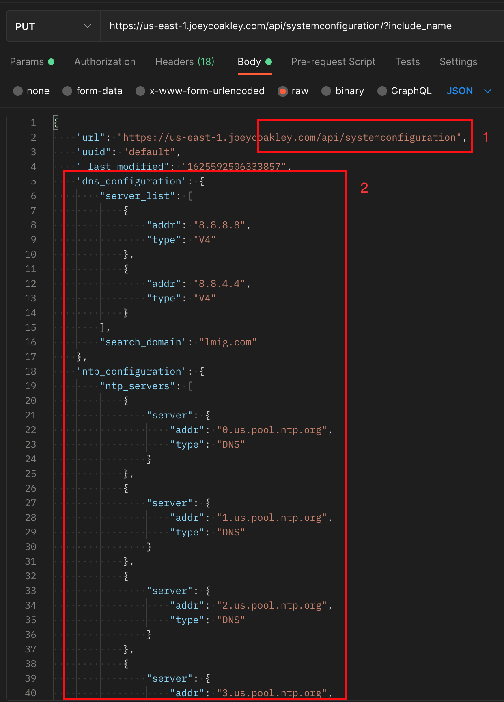
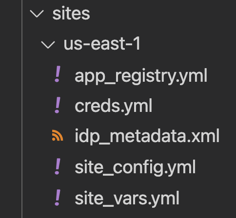
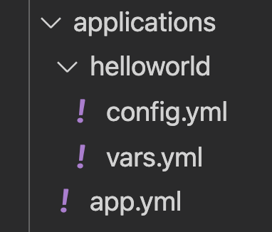
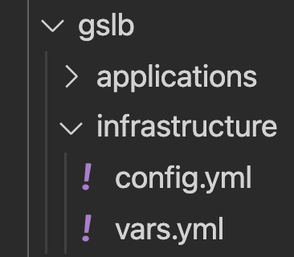
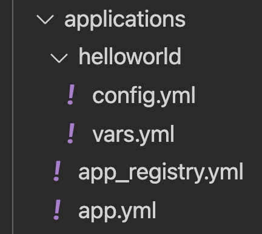

# Example Ansible Playbook Strategy
This repository is meant to provide an example framework for Ansible automation. The intended audience is beginner to intermediate Ansible users. At a high level, it separates infrastructure tasks from application tasks for both local and global (GSLB) items. There are four playbooks that can be ran for different purposes:

| Playbook Name     	| Usage                                                            	|
|-------------------	|------------------------------------------------------------------	|
| app_deploy        	| Deploy or update a non-GSLB application                          	|
| site_deploy       	| Deploy or update an Avi controller cluster                       	|
| gslb_infra_deploy 	| Deploy or update GSLB leader, including adding sites to topology 	|
| gslb_app_deploy   	| Deploy or update a GSLB application                              	|

## Table of Contents
- [Getting Started](#getting-started)
- [Relationship of Avi Ansible Modules to the Avi API](#relationship-of-avi-ansible-modules-to-the-avi-api)
- [Debugging](#debugging)
- [Site Configuration](#site-configuration)
  * [Example Site Deployment](#example-site-deployment)
  * [sites/site_name/app_registry.yml](#sites-site-name-app-registryyml)
  * [sites/site_name/creds.yml](#sites-site-name-credsyml)
  * [sites/site_name/idp_metadata.xml](#sites-site-name-idp-metadataxml)
  * [sites/site_name/site_config.yml](#sites-site-name-site-configyml)
  * [sites/site_name/site_vars.yml](#sites-site-name-site-varsyml)
- [Application Configuration](#application-configuration)
  * [Example Application Deployment](#example-application-deployment)
  * [applications/app.yml](#applications-appyml)
  * [applications/app_name/config.yml](#applications-app-name-configyml)
  * [applications/app_name/vars.yml](#applications-app-name-varsyml)
- [GSLB Infrastructure Configuration](#gslb-infrastructure-configuration)
  * [Example GSLB Infrastructure Deployment](#example-gslb-infrastructure-deployment)
  * [gslb/infrastructure/config.yml](#gslb-infrastructure-configyml)
  * [gslb/infrastructure/vars.yml](#gslb-infrastructure-varsyml)
- [GSLB Application Configuration](#gslb-application-configuration)
  * [Example GSLB Application Configuration](#example-gslb-application-configuration)
  * [gslb/applications/app.yml](#gslb-applications-appyml)
  * [gslb/applications/app_registry.yml](#gslb-applications-app-registryyml)
  * [gslb/applications/app_name/config.yml](#gslb-applications-app-name-configyml)
  * [gslb/applications/app_name/vars.yml](#gslb-applications-app-name-varsyml)


## Getting Started
This framework is tested using specific versions of Ansible and makes use of libraries which are needed for playbooks to execute successfully. When developing your own automation, it is highly encouraged to make use of Python's virtual environments to avoid conflicts with other version of packages which may already be installed.

```
git clone https://github.com/joeycoakleyavi/LM_Ansible.git
cd LM_Ansible
python3 -m venv env
source env/bin/activate
pip3 install -r requirements.txt
ansible-galaxy install avinetworks.avisdk
ansible-galaxy collection install vmware.alb
```

## Relationship of Avi Ansible Modules to the Avi API
As a general rule, Avi Ansible Modules have a direct correlation to the Avi API. Whenever *any* configuration is changed within Avi, be it through the UI or the CLI, the change is translated to an API call. For example, if you were to update the DNS resolvers for the controller cluster through the UI, you can either use the developer console or a tool like Postman to view the API call which your browser made. This results in an example API call which was successful that you can work from, although it will contain all attributes and be much more verbose than what may be needed.

In the following example:
1. Shows the API endpoint which the call was sent to
2. Shows a partial body of the request. In this case we see dns_configuration and ntp_configuration



The request body would translate to the following format in YAML

```
dns_configuration:
  server_list:
    - addr: 8.8.8.8
      type: V4
    - addr: 8.8.4.4
      type: V4
  search_domain: lmig.com

ntp_configuration:
  ntp_servers:
    - server:
        type: DNS
        addr: 0.us.pool.ntp.org
    - server:
        type: DNS
        addr: 1.us.pool.ntp.org
    - server:
        type: DNS
        addr: 2.us.pool.ntp.org
    - server:
        type: DNS
        addr: 3.us.pool.ntp.org
```

To then use this in the aviconfig module, the api endpoint (1) becomes the key, and our request attributes (2) become our values (note that values are defined in a list).

```
avi_config:
  systemconfiguration:
    - ntp_configuration:
            ntp_servers:
                - server:
                    type: DNS
                    addr: 0.us.pool.ntp.org
                - server:
                    type: DNS
                    addr: 1.us.pool.ntp.org
                - server:
                    type: DNS
                    addr: 2.us.pool.ntp.org
                - server:
                    type: DNS
                    addr: 3.us.pool.ntp.org
        dns_configuration:
            server_list:
            - addr: 8.8.8.8
                type: V4
            - addr: 8.8.4.4
                type: V4
            search_domain: lmig.com
        .....
```
## Debugging
For any of the playbooks in this repository, you can gather debugging information by setting `avi_role_config_log_mode=false`.

Example: `ansible-playbook app_deploy.yml -e "site=us-east-1 avi_role_config_log_mode=false"`

## Site Configuration
Sites are tracked in the `sites` folder. Each subfolder represents a different site, and within that folder are files which help define the site configuration.



**NOTE**

A site is a logical construct for an Avi cluster, and is not tied to any physical entity.

### Example Site Deployment
`ansible-playbook site_deploy.yml -e site=us-east-1`

### sites/site_name/app_registry.yml
Contains which applications should be deployed to this site. By decoupling sites to applications, a (non-GSLB) application can be defined once and deployed to one or more sites. This file is not used during the creation of a site, so there is no dependency on this file being defined before a site can be provisioned.

### sites/site_name/creds.yml
Contains controller address information and credentials to authenticate. 

**NOTE**

Ansible has the capability to securely access a password, but it is outside the scope of this document. See Ansible lookups or Ansible Vault for some examples.

### sites/site_name/idp_metadata.xml
This file serves as an example of how you may have a large body of text which is needed in your configuration. In the example, SSO is configured in this controller cluster, which requires the IDP Metadata on the Avi side. It is not required to provision a site.

### sites/site_name/site_config.yml
Contains the site's configuration in YAML. Please see section [Relationship of Avi Ansible Modules to the Avi API](#relationship-of-avi-ansible-modules-to-the-avi-api) for details on how to build the configuration.

### sites/site_name/site_vars.yml
Contains site specific variables which can be used to promote reusability of site_config.yml. For example, in us-east-1 you could have defined an AWS cloud like so

```
  cloud:
    - name: AWS
      vtype: CLOUD_AWS
      aws_configuration:
        use_iam_roles: true
        route53_integration: true
        region: us-east-1
        vpc_id: vpc-123456
        zones: 
          - mgmt_network_uuid: subnet-123456
              mgmt_network_name: subnet-a
              availability_zone: us-east-1a
          - mgmt_network_uuid: subnet-789012
              mgmt_network_name: subnet-b
              availability_zone: us-east-1b
```

This is a perfectly valid configuration, but is very site specific. Instead, we can use variables to substitute our values into the configuration.

site_config.yml
```
  cloud:
    - name: AWS
      vtype: CLOUD_AWS
      aws_configuration:
        use_iam_roles: true
        route53_integration: true
        region: "{{ aws_region }}"
        vpc_id: "{{ vpc_id }}"
        zones: "{{ management_subnets }}"
```
site_vars.yml
```
management_subnets:
  - mgmt_network_uuid: subnet-123456
    mgmt_network_name: subnet-a
    availability_zone: us-east-1a
  - mgmt_network_uuid: subnet-789012
    mgmt_network_name: subnet-b
    availability_zone: us-east-1b
aws_region: us-east-1
vpc_id: vpc-123456
```

The benefit here is that we can reuse site_config.yml elsewhere and simply change our variables to match what our configuration should be.

## Application Configuration
Applications are defined in the `applications` folder. These are applications which Avi will be responsbile for server load balancing for. Each folder inside `applications` represents a different application which may be deployed into one or more sites. Once the application is defined, you can control which sites it will be deployed to by adding the application name to the [app_registry.yml](#sites-site-name-app-registryyml) of the respective site.



### Example Application Deployment
`ansible-playbook app_deploy.yml -e site=us-east-1`

### applications/app.yml
Do not modify this file. It is called as part of the app_deploy.yml playbook.

### applications/app_name/config.yml
Contains the application's configuration in YAML. Please see section [Relationship of Avi Ansible Modules to the Avi API](#relationship-of-avi-ansible-modules-to-the-avi-api) for details on how to build the configuration.

### applications/app_name/vars.yml
Contains application-specific variables. Usage and benefits of using variables along with examples are found in the [site variables section.](#sites-site-name-site-varsyml)

***NOTE***

When defining your application configuration, you have access to application *and* site variables. Making use of both will ensure that your application can be deployed to any site without needing to modify your configuration for each deployment.

Take for example our helloworld application's config.yml. `asg_name` is a variable defined in `applications/helloworld/vars.yml` and `subnet_a_uuid` is defined in both us-east-1 and us-west-2 site vars `sites/{{ site }}/site_vars.yml`

```
avi_config:
  pool:
    - name: "{{ app_name }}-Pool"
      <snipped>
      external_autoscale_groups:
        - "{{ asg_name }}"
      <snipped>

  vsvip:
    - name: "vsvip-{{ app_name }}-AWS-Cloud"
      tenant_ref: '/api/tenant?name=admin'
      cloud_ref: '/api/cloud?name=AWS'
      state: present
      vip:
        - vip_id: "1"
          <snipped>
          network_ref: '/api/network/{{ subnet_a_uuid }}#{{ subnet_a_name }}'
          subnet_uuid: '{{ subnet_a_uuid }}'
          <snipped>
```

## GSLB Infrastructure Configuration
At the time of writing this document, any GSLB configuration must be done via the GSLB leader. The leader site is defined in the [GSLB vars file.](#gslb-infrastructure-varsyml) 



### Example GSLB Infrastructure Deployment
`ansible-playbook gslb_infra_deploy.yml`

### gslb/infrastructure/config.yml
Contains the GSLB infrastructure configuration in YAML. Please see section [Relationship of Avi Ansible Modules to the Avi API](#relationship-of-avi-ansible-modules-to-the-avi-api) for details on how to build the configuration.

### gslb/infrastructure/vars.yml
Contains GSLB Infrastructure-specific variables, including the **GSLB leader**. Usage and benefits of using variables along with examples are found in the [site variables section.](#sites-site-name-site-varsyml)

## GSLB Application Configuration
Avi GSLB applications follow a similar approach to [server load balanced applications](#application-configuration), in that an application is defined and then registered in an application registry. While the registry concept is not used for a per-site, it can be used to allow an administrator to toggle which applications should or should not be deployed, although this functionality does not exist in this example.




### Example GSLB Application Configuration
`ansible-playbook gslb_app_deploy.yml`

### gslb/applications/app.yml
Do not edit this file. It is called by `gslb_app_deploy.yml`

### gslb/applications/app_registry.yml
Contains registry of GSLB applications which should be deployed.

### gslb/applications/app_name/config.yml
Contains the GSLB application configuration. Please see section [Relationship of Avi Ansible Modules to the Avi API](#relationship-of-avi-ansible-modules-to-the-avi-api) for details on how to build the configuration.

### gslb/applications/app_name/vars.yml
Contains GSLB application-specific variables. Usage and benefits of using variables along with examples are found in the [site variables section.](#sites-site-name-site-varsyml)